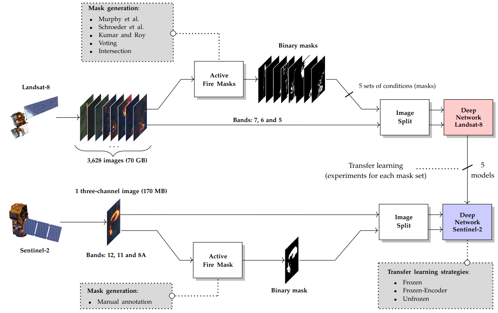
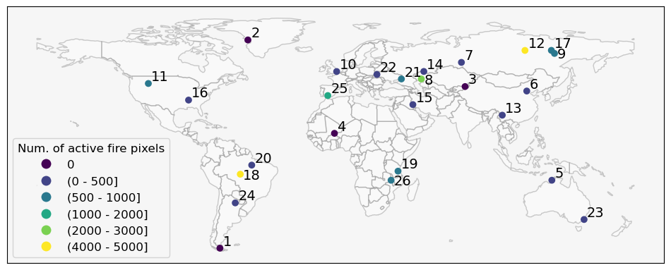

# Paper

You can read the paper avaliable in the [IEEE Journal of Selected Topics in Applied Earth Observations and Remote Sensing](https://ieeexplore.ieee.org/stamp/stamp.jsp?tp=&arnumber=10620606)


# Active fire segmentation with deep learning: a transfer learning study from Landsat-8 to Sentinel-2


To segment active fire, we explored the bands similarities between Landsat-8 and Sentinel-2 to train a U-net with images of the former and adjust it using a single image to the latter, as depicted in the image below:



We use the dataset built by [Pereira et al. (2021)]() to train Convolutional Neural Networks (CNN) to segmentate active fire using Landsat-8 images, then we explored different approachs for Transfer Learning to adapt the networks for Sentinel-2 images. To do that, we explore bands with similar wavelenghts in these satellites. Despite the similarities, the bands are not strictly equivalent, therefore, there are some differences in the information captured by the satellites. To overcome these differents we used a Batch Normalization layer to adjust the Sentinel-2 values.  

This repository contains instructions to download the images used in the expiriments and the weights for both the networks trained with Landsat-8 images and the models fine-tunned with Sentinel-2 images.

## Authors

[Andre Minoro Fusioka](https://github.com/Minoro)

[Gabriel Henrique de Almeida Pereira](https://github.com/pereira-gha)

[Bogdan Tomoyuki Nassu](https://github.com/btnassu)

[Rodrigo Minetto](https://github.com/rminetto)


# Datasets

We used two datasets to perform this work. The first consist of Landsat-8 images, with masks generated by thresholding algorithms. The second with Sentinel-2 images manually annotated. To train the base network, we used the Landsat-8 dataset built in the work [Active fire detection in Landsat-8 imagery: A large-scale dataset and a deep-learning study](https://www.sciencedirect.com/science/article/abs/pii/S092427162100160X), this dataset in available on [GitHub/Google Drive](https://github.com/pereira-gha/activefire/). 

With the base networks ready, we used a single Sentinel-2 image to adjust to the new satellite. The second dataset consist of 26 Sentinel-2 images, visually inspected and manually annotated. From the 26 images, 22 contains at least one fire pixel, while 4 images has no fire. The disposition of the images around the world can be seen in the picture below.



The Sentinel-2 images and the manual annotations are available in the [Google Drive](https://drive.google.com/file/d/1IiROeFcxoLwSLZrDjstqN7nRxxMcgDa9/view?usp=drive_link), we provide the entire scene with 5490x5490 pixels and also the patches with 256x256 pixels (12,584 patches in total). The images (and patches) have all 20m bands, but in this expirement we used only three. In addition to the manual annotation we also provide the masks generetad by [Murphy et al. (2016)](http://dx.doi.org/10.1016/j.rse.2016.02.027), [Liu et al. (2022)](https://doi.org/10.1016/j.isprsjprs.2021.05.008) and [Kato and Nakamura, (2022)](https://ieeexplore.ieee.org/document/8127081) methods, and the masks generated by combinations of these methods, using their intersection and a voting scheme (at least two methods must agree where fires occur).

We provide a script for unzip the Sentinel-2 dataset, the script `src/utils/unzip_sentinel_dataset.py` to unzip both, the 256x256-pixels patches dataset and the version with entire scenes. You can change the constant `UNZIPING_SCENE` to `True` to unzip the dataset with scenes or set it to `False` to unzip the  256x256-pixels version. After setting the constant properly, inside the folder `src/utils` you can run:

```shell
python unzip_sentinel_dataset.py
```

# Training the base network

We trained a U-net with Landsat-8 images using different images, masks and band combinations. To train these networks we used the data available in the repository built by [Pereira et al.](https://github.com/pereira-gha/activefire/). Although the authors provided the weights of the trained models, we chose to use different bands, so it was necessary to train the models with the appropriate bands. We trained the models using the bands SWIR-2 (band-7), SWIR-1 (band-6) and NIR (band-5) from Landsat-8 in different combinations, using the masks created by the [Kumar and Roy (2018)](https://doi.org/10.1080/17538947.2017.1391341), [Murphy et al. (2016)](http://dx.doi.org/10.1016/j.rse.2016.02.027),  [Schroeder et al. (2016)](http://dx.doi.org/10.1016/j.rse.2015.08.032), and their combination by intersection and majority-voting.


If you want to train the base model by yourself you can follow the instructions available in the [Pereira et al.](https://github.com/pereira-gha/activefire/) repository, but it is necessary to adjust the bands used to train the models. Alternatively, there are a script in this repository in `src/landsat/train_base_model.py` to help you train the base model. You can chose the mask (Kumar-Roy, Murphy, Schroeder, Voting or Intersection) to train the network using the argument `--mask`, you can also adjust the batch-size (`--batch-size`), the learning rate (`--lr`), the number of epochs (`epochs`), the early stoping patcience (`--early-stoping-patience`) and also the band combination to train (`--bands`). If you don't use any argument it will use the configuration define in the file `scr/landsat/landsat_config.py`. When using this training script the final weights will be saved in the folder `resources/landsat/output/`. You can change it in the configuration file.


In this repository we also provide the trained weights from the networks trained with the mentioned dataset, you can follow the instructions in the [Downloading the pre-trained weights for Landsat-8](#downloading-the-pre-trained-weights-for-landsat-8). 


## Downloading the pre-trained weights for Landsat-8

Besides the datasets and code, you can download the weights for the trained models. They are available on [TODO](). We provide the weights for the U-net trained with Landsat-8 images and the models after the fine-tunning with Sentinel-2 images.

For Landsat-8, the network was trained with 256x256-pixels patches, using the bands SWIR-2 (band-7), SWIR-1 (band-6) and NIR (band-5) forming a 3-channel image. The masks used to train the model was created by the [Kumar and Roy (2018)](https://doi.org/10.1080/17538947.2017.1391341), [Murphy et al. (2016)](http://dx.doi.org/10.1016/j.rse.2016.02.027),  [Schroeder et al. (2016)](http://dx.doi.org/10.1016/j.rse.2015.08.032), and their combination by intersection and majority-voting. Each of these set of masks was used to train an indepentend base model, therefore, there are 5 base model available trained with Lansat-8 data. The table below shows the directory in this repository for each base model:

| Satellite | Masks                    | Trained Model Path                                                                                         |
|-----------|--------------------------|------------------------------------------------------------------------------------------------------------|
| Landsat-8 | Kumar and Roy (2018)     | `resources/landsat/weights/unet/Kumar-Roy/B7B6B5/model_unet_Kumar-Roy_765_final_weights.h5`         |
| Landsat-8 | Murphy et al. (2016)     | `resources/landsat/weights/unet/Murphy/B7B6B5/model_unet_Murphy_765_final_weights.h5`               |
| Landsat-8 | Schroeder et al. (2016)  | `resources/landsat/weights/unet/Schroeder/B7B6B5/model_unet_Schroeder_765_final_weights.h5`         |
| Landsat-8 | Intersection             | `resources/landsat/weights/unet/Intersection/B7B6B5/model_unet_Intersection_765_final_weights.h5`   |
| Landsat-8 | Voting                   | `resources/landsat/weights/unet/Voting/B7B6B5/model_unet_Voting_765_final_weights.h5`               |

In this repository the Landsat-8 weights are available in the `resources/landsat/weights/unet/landsat_weights.zip` ziped file, you can use the script `src/utils/unzip_landsat_weights.py` to extract the weights and put they in the correct folder. Inside the `src/utils` folder you can run: 

```shell
python unzip_landsat_weights.py
```


# Fine-tune with Sentinel-2 images

This section will guide you in how to fine-tune the trained models to Sentinel-2, if you don't want to fine-tune by yourself you can download the final models as described in the section [Downloading the Sentinel-2 fine-tuned models](#downloading-the-sentinel-2-fine-tuned-models). 

After training the base networks with Landsat-8 images, we performed transfer-learning using similar bands of Sentinel-2. In our experiments we reserved the five images with the most fire patches to form five distinct folds to perform the fine-tuning to Sentinel-2 (the other images was used to evalute the model), each of the five images was used separately as a "fold", repeting the expiriments five times (one for each train image).


You can follow the [Defining folds](#defining-folds) section if you want to split the Sentinel-2 dataset to fine-tune the model. If you want the check the steps for fine-tuning the model you can check the [Performing the fine-tuning](#performing-the-fine-tuning) section.


## Defining folds

The first step to fine-tuning is to define which images are used for training, validation and testing. In this repository there is the script `src/transfer-learning/generate_kfolds_manual_annotation.py` that can be used to perform this division. The first time you run this script it will process all annotations computing the number of fire pixels and the maximum value of the bands used and saved to the file defined in `CSV_WITH_NUMBER_OF_FIRE_PIXELS_OF_EACH_PATCH` constant, if the file already exists it will not be re-computed. You can change the images directory in the `IMAGES_DIR` constant and the annotations directory in the `MASKS_DIR` constant. If you don't want to use five images/folds you can change the value in the `NUM_TOP_FIRE_IMAGES_TO_TRAIN` constant. The proportion of fire-patches reserved to validation can be set in the `VALIDATION_FRACTION` constant, the default value is 20%. The constant named `NON_FIRE_PROPORTION` defined the proportion of patches without fire to be used to fine-tuning the networks, the default value is 1, this means that for each fire-patch one patch without fire will be used. The constants `OUTPUT_PATH` and `OUTPUT_FILE` define the directory and the file of the output. Once you have your script configured you can run:

```shell
python generate_kfolds_manual_annotation.py
```

The file generated by this script contains the patches to be used for each fold of the experiments, dividing the images into their respective set (train/validation/test), this file will be used to fine-tuning the base model to Sentinel-2 images.

## Performing the fine-tuning

The script `scr/transfer-learning/transfer_learning.py` can be used to fine-tune the base networks, you can configure it using parameters or set the configuration in the `src/transfer-learning/config.py`. The `transfer_learning.py` script needs the folds files (generated before) to be set in the constant `SENTINEL_MANUAL_ANNOTATIONS_FOLDS_CSV_PATH` or passed by `--csv-folds-file` argument. It will fine-tune each base model (defined in the constant `PRETRAINED_MASKS` or set by `--base-models` argument), the names that are accepted by this parameters are the list that refers to the (authors) name of the method used generated masks used to train the base model. You need to set the constant `PRETRAINED_WEIGHTS_PATH` to the path were the weights of the base model are stored. 

We evaluated three transfer learning strategy, you can control those you want to use in the constant `TRANSFER_LEARNING_STRATEGY` (or using the parameter `--transfer-learning-strategy`), the value `freeze_all` will freeze all weights learned from Landsat-8 training phase, the `unfreeze` will keep the weights unfrozen and free to learn, and `freeze_encoder` will freeze the weights of the first half of the U-net. 

By default the script will fine-tune the models using the manual annotations, but you can also perform this task using the Sentinel-2 masks generated by thresholding algorithms, you can change the configuration using the `--mask` argument. You 

It is important to keep in mind that, despite the bands from Lansat-8 and Sentinel-2 shares similarities they are not strictly equivalent, also, the spatial resolution is different for each satellite (30m to Lansat-8 and 20m to Sentinel-2), therefore the network needs to learn how to understand this changes. In order adapt the network we added an batch normalization layer immediately after the input for the Sentinel-2 images. If you don't want to use the initial Batch Normalization layer you can remove it from the code, or just change the constant `NORMALIZATION_MODE` (or the argument `--normalization`) to `no-bn`. If you set the value to `None` you need to adjust image scale by yourself to use the pre-trained networks.


You can also specify the bands that will be used to perform the transfer learning, you can set the band number that was used in the training phase. For example, setting the constant `BANDS` to `(7,6,5)` it will read the equivalent bands of Sentinel --- the bands 12, 11 and 8A. Keep in mind that the implementation was done for the images available in the dataset, if you are using images from others sources you must adjust the code to read the bands properly.  

This script have some others configurations, like the number of epochs to perform the transfer learning (`EPOCHS` e `--epochs`), `--checkpoint-freq` to define the frequence for chekpoints, `--gpu` to set the GPU device.

This script will fine-tune the networks and evaluated them, each model will be saved the the `OUTPUT_WEIGHTS_TRANSFER_LEARNING_PATH` directory, and the results will be saved as json files in the `OUTPUT_RESULTS_TRANSFER_LEARNING_PATH` directory. You can set the `--identification` argument to define a prefix for the output folder. 

Once you have all your configurations done, you can execute the script using:

```shell
python transfer_learning.py
```


# Generating active fire masks for Sentinel-2

The fine-tuned models can be used to segmentate Sentinel-2 images and generate the active fire masks. Besides the trained networks you can also generate the active fire masks using the tresholding algorithms available in this repository. We provide three methods that can be used in Sentinel-2 images, namely [Kato-Nakamura](https://ieeexplore.ieee.org/document/8127081), [Liu et al.](https://doi.org/10.1016/j.isprsjprs.2021.05.008) and [Murphy et al.](http://dx.doi.org/10.1016/j.rse.2016.02.027). All methods rely on bands SWIR-2 (band-12), SWIR-1 (bands-11) and NIR (band-8A) from Sentinel-2.

If you want to generate active fire masks for Landsat-8, you can check the repository built by [Pereira et al.](https://github.com/pereira-gha/activefire/).


## Generating active fire masks with deep learning

With the fine-tuned model you can use it to generate active fire masks for Sentinel-2. If you used the code to fine-tune from scrach it will generated the predictions and evaluate the models, but it not save the predictions. You can use the script `best_models_inference.py` to generate the predictions using the best model from the folds. It needs the results of each fold to evaluate which one perform better, the best model will be loaded and will be used to generate the active fire masks.

In the script, if needed, you can change the `FOLDS_FILE` to the file with the definition of the train/test/validation folds. If you changed the default model name you need to change the `MODELS` constant. The `MODELS_PATH` constant must be set to the path of the fine-tuned models and `RESULTS_MODELS_PATH` to the directory were the results of the transfer learning was saved. You can change the images and masks path using the constants `IMAGES_DIR` and `MASKS_DIR`.

Inside the `src/transfer-learning` directory you can run:

```shell
python best_models_inference.py
```

The predictions will be saved inside the `OUTPUT_DIR` directory.

Alternatively you can use the `src/transfer-learning/predict.py` script to generate the predictions, this script accept the argument `--png` to save the predictions in PNG.


## Generating active fire masks with threshold methods

The thresholding methods requires the entire scenes (5490x5490 pixels) and the metadata to generate the active fire masks. The implementation of the thresholding methods can be found in the `src/active_fire/general.py`, this script is used by `src/thresholding/generate_afi_mask.py` to process the dataset images and generate the active fire. You can define where the Sentinel-2 images in the `IMAGES_STACK_DIR` constant and the metadata in `METADATA_DIR` constant. The images must be a stack of 20m bands with the postfix `_20m_stack.tif`. You can choose the methods you want to use in the constant named `ALGORITHMS`, each method will generate a mask for each image found. If you want to process only some images, you can define the prefix of the stacks in the `STACKS` constant. Inside the `src/thresholding` you can run:

```shell
python generate_afi_mask.py
```

By default it will save the masks as TIF images in the folder defined in the `OUTPUT_DIR` constant, each method will create a folder and the masks will be saved inside. Note that the masks have 5490x5490 pixels, if you want to use they to fine-tune the network you need to crop the masks as 256x256-pixels. If you set the constant `SAVE_AS_TXT` to `True` the prediction will be saved as a txt file, this file can be used to evaluate the performance of the methods.

## Evaluating the thresholding algorithms

After generating the algorithms predictions you can evalute the performance of the methods compared with the manual annotations. The script `src/transfer-learning/evaluate_fold_afi_algorithms.py` will evaluate the output produced by the methods and save the results to the disk. You need to set `PREDICTION_FORMAT` to the format of the images (accepted values: txt or tif). The `PREDICTIONS_DIR` should be set to the directory of the predictions produced by the thresholding algorithms, the `ANNOTATIONS_DIR` must be the path of the directory of the manual annotations, the predictions and annotations must be in the same format. The `DATAFRAME_FOLDS_PATH` define the csv with the definition of the used folds, with train/validation/test division. The output will be saved in json at `RESULTS_OUTPUT_DIR` directory. Inside the `src/transfer-learning` you can run:

```shell
python evaluate_fold_afi_algorithms.py
```

# Utils scripts

We provide some scripts with utils funcionalities, for example, if you want to combine the thresholding masks by intersection or voting using the script `src/utils/make_voting_and_intersection_masks.py`. You need to set the path for the original images (5490x5490-pixels) in the `IMAGES_STACK_PATH` constant and `MASKS_PATH` to the masks path of the thresholding algoriths. The outputs will be saved at `OUTPUT_PATH` directory. You can run it inside the `src/utils/` folder:

```shell
python make_voting_and_intersection_masks.py
```

The script to make the predictions of the thresholding algoriths allows you to save the output as txt file, these files can be used to evaluate the algorithms. If you chose this format, you will need annotations in the same format, to convert the annotations to this format you can run (inside the utils folder):

```shell
python annotations_to_txt.py
```

We provide a script to rebuild the annotations from the 256x256-pixels patches. It read the 20m image stack to retrive the meta information about the location of the image, then it will read each the 256x256-pixels patches and reorganise them by the geo-location, generating the final image. You need to set the `STACKS_PATH` constant to the path with the Sentinel-2 images with the 20m bands. The `CROPED_ANNOTATIONS_PATH` constant must be set to the path with the annotations in 256x256 format. The final image will be saved at `OUTPUT_SCENE_ANNOATIONS_PATH`. To use the script you can run:  

```shell
python rebuild_annotations_scene.py
```

Similarly, you can rebuild the predictions produced by the networks using:

```shell
python rebuild_predictions_scene.py
```

You need to set the `CROPED_IMAGES_PATH` constant to the path with path were the predictions produced by the networks are stored.

Besides the utils script we also provide a Jupyter Notebook to help you see the results generated by the networks and algorithms, the notebook is `src/notebook/`


# Citation

You can read the paper avaliable in the [IEEE Journal of Selected Topics in Applied Earth Observations and Remote Sensing](https://ieeexplore.ieee.org/stamp/stamp.jsp?tp=&arnumber=10620606)


```bibtex
@ARTICLE{Fusioka2024,
  author={Fusioka, André Minoro and Pereira, Gabriel Henrique de Almeida and Nassu, Bogdan Tomoyuki and Minetto, Rodrigo},
  journal={IEEE Journal of Selected Topics in Applied Earth Observations and Remote Sensing}, 
  title={Active Fire Segmentation: A Transfer Learning Study From Landsat-8 to Sentinel-2}, 
  year={2024},
  volume={},
  number={},
  pages={1-19},
  keywords={Earth;Remote sensing;Artificial satellites;Satellites;Image segmentation;Transfer learning;Training;Active fire segmentation;deep learning;landsat-8;sentinel-2;transfer learning},
  doi={10.1109/JSTARS.2024.3436811}
}
```